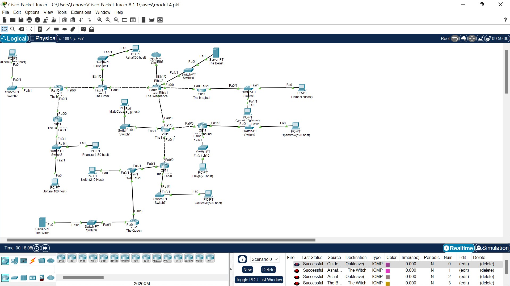

# Jarkom-Modul4-E14-2022

| Nama                   | NRP        |
| ---------------------- | ---------- |
| Dhafin Almas Nusantara | 5025201064 |

## Topologi

## VLSM

| Node | Alokasi | Netmask |
| ---- | ------- | ------- |
| A1   | 1001    | /22     |
| A2   | 2       | /30     |
| A3   | 2       | /30     |
| A4   | 251     | /24     |
| A5   | 212     | /24     |
| A6   | 2       | /30     |
| A7   | 501     | /23     |
| A8   | 71      | /25     |
| A9   | 121     | /25     |
| A10  | 2       | /30     |
| A11  | 121     | /25     |
| A12  | 2       | /30     |
| A13  | 2       | /30     |
| A14  | 2       | /30     |
| A15  | 271     | /23     |
| A16  | 2       | /30     |
| A17  | 51      | /26     |
| A18  | 2       | /30     |

- **Pohon IP VLSM**

- **Pembagian Ip**

| Node           | Interface | IP                |
| -------------- | --------- | ----------------- |
| The Minister   | Fa0/0     | 192.199.11.193/30 |
|                | Fa0/1     | 192.199.11.197/30 |
|                | Fa1/0     | 192.199.0.1/22    |
| The Dauntless  | Fa0/0     | 192.199.11.198/30 |
|                | Fa0/1     | 192.199.8.1/24    |
| The Order      | Fa0/0     | 192.199.11.213/30 |
|                | Fa1/0     | 192.199.8.129/26  |
|                | Fa0/1     | 192.199.8.194/26  |
| The Resonance  | Fa0/0     | 192.199.11.217/30 |
|                | Fa0/1     | 192.199.11.214/30 |
|                | Eth1/1    | 192.199.11.209/30 |
|                | Eth1/2    | 192.199.11.221/30 |
| The Magical    | Fa0/0     | 192.199.11.218/30 |
|                | Fa0/1     | 192.199.6.1/23    |
| The Instrument | Fa0/0     | 192.199.11.210/30 |
|                | Fa0/1     | 192.199.11.225/30 |
|                | Fa1/0     | 192.199.11.205/30 |
|                | Fa1/1     | 192.199.11.1/25   |
| The Rifthound  | Fa0/0     | 192.199.11.206/30 |
|                | Fa0/1     | 192.199.10.1/26   |
|                | Fa1/0     | 192.199.10.129/26 |
| The Firefist   | Fa0/0     | 192.199.11.226/30 |
|                | Fa0/1     | 192.199.9.1/24    |
|                | Fa1/0     | 192.199.4.1/23    |
| The Queen      | Fa0/0     | 192.199.9.3/24    |
|                | Fa0/1     | 192.199.11.201/30 |

- **Routing pada CPT**

| Node           | Stating Routing                      |
| -------------- | ------------------------------------ |
| The Minister   | 0.0.0.0/0 via 192.199.11.194         |
|                | 192.199.8.0/24 via 192.199.11.198    |
| The Dauntless  | 192.199.0.0/22 via 192.199.11.197    |
|                | 0.0.0.0/0 via 192.199.11.197         |
| The Order      | 192.199.0.0/22 via 192.199.11.193    |
|                | 0.0.0.0/0 via 192.199.11.193         |
|                | 0.0.0.0/0 via 192.199.11.214         |
| The Resonance  | 0.0.0.0/0 via 192.199.11.213         |
|                | 192.199.11.128/26 via 192.199.11.213 |
|                | 192.199.6.0/23 via 192.199.11.218    |
|                | 192.199.11.0/25 via 192.199.11.210   |
|                | 0.0.0.0/0 via 192.199.11.210         |
| The Magical    | 192.199.11.220/30 via 192.199.11.217 |
|                | 0.0.0.0/0 via 192.199.11.217         |
| The Instrument | 0.0.0.0/0 via 192.199.11.209         |
|                | 0.0.0.0/0 via 192.199.11.206         |
|                | 0.0.0.0/0 via 192.199.11.226         |
| The Rifthound  | 0.0.0.0/0 via 192.199.11.205         |
| The Firefist   | 0.0.0.0/0 via 192.199.11.225         |
|                | 0.0.0.0/0 via 192.199.9.3            |
| The Queen      | 0.0.0.0/0 via 192.199.9.1            |

- **Percobaan testing**

